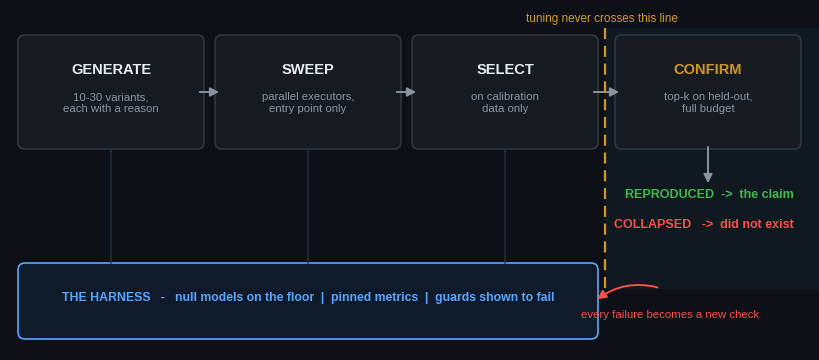

# breakthrough-harness

**Make your research agent hard to fool — starting with itself.**

[](https://github.com/GuoCheng24/breakthrough-harness/actions/workflows/test.yml) [](LICENSE) [](examples/toy_loop.py)

[中文版](README.zh-CN.md) · works with any agent stack · pure methodology + two runnable demos


That is `python examples/toy_loop.py` (< 30 s, numpy only): a candidate that
secretly fits the calibration answers looks like a breakthrough, and the
held-out confirmation executes it. **This half screen is the entire
philosophy of the repository.**

Most agent harnesses teach an agent how to work. This one teaches a research
agent how **not to deceive itself** — because in research the failure mode is
rarely "the code crashed" and almost always "the number looked great and was
wrong." Every rule here was paid for by a real failure; none is hypothetical.
The repository follows its own rules: what these pages claim, `tests/` checks
on every push.

## The core claim

> **Breakthroughs are a throughput problem.**
> breakthrough ≈ many cheap attempts × a scoring function that is hard to fool.

Serial, hand-crafted experiments produce a few dozen attempts per year; the
systems that actually produced constructive breakthroughs (program search
over mathematical constructions, tournament-style hypothesis engines) share
one skeleton: **parallel cheap generation + automated selection that is hard to fool**.
You cannot copy their compute; you can copy the skeleton — if the scoring
function is engineered with the rigor a referee would apply. That engineering
is this repository.

And a quieter corollary: when every attempt is expensive, the rational move
is to audit what exists rather than build what might fail — audits have
guaranteed deliverables. Teams that keep sliding into negative-result papers
are responding rationally to the price of an attempt. **Fix the price and the
sliding stops.**



## What is inside

| Directory | What it gives you |
|---|---|
| [`loop/`](loop/LOOP.md) | The breakthrough loop: generate-with-reasons → parallel sweep → select on calibration → **confirm on held-out** |
| [`harness/`](harness/CHECKLIST.md) | Building a scoring harness, incl. the **anti-cheat four**: null models on the floor; metric conventions pinned & double-reported; calibration/evaluation physically separated; absurd baseline ⇒ freeze everything |
| [`gates/`](gates/GATES.md) | Go/no-go gates: target triage, the **claim-polarity red line**, occupancy checks at claim level |
| [`rules/`](rules/RULES.md) | 11 engineering rules, **each ending with the real failure that paid for it** |
| [`examples/`](examples/) | Two runnable demos: the cheater above, and "the flat sweep that lied" (force_balance.py, rule 3 live) |
| [`adapters/`](adapters/) | Drop-ins for **your** stack — see below |
| [`template/`](template/) | **A runnable campaign starter**: entry-point harness with registered nulls and a live freeze rule, logged held-out access, a round ledger, and guards with a deliberate-violation test — adapt it to your task in an afternoon |

## The other demo: the flat sweep that lied

```text
Act 1  lam in {0.1, 1, 10, 100}   -> scores 2.1, -0.0, -0.0, -0.0   "flat, the parameter is inert"
Act 2  one gradient-norm evaluation -> every value crushed the data term; balance is ~0.05
Act 3  sweep around the balance    -> clean interior peak at lam = 0.0015, 22.6 dB
```

`python examples/force_balance.py`: a four-decade hyperparameter sweep that
looks flat because the data term is a *mean* and the regulariser a *sum* —
every tested value sat on one side of the force balance. One gradient-norm
evaluation finds the real range. Rule 3, live.

## Use it with your agent, whatever it is

The methodology is plain markdown — nothing here depends on any vendor. The
adapters just package it for wherever your agent reads instructions:

| Your stack | Do this |
|---|---|
| **DeepSeek Harness** | **nothing to copy** — clone this repo and DSH already finds [`.agents/skills/breakthrough-loop/`](.agents/skills/breakthrough-loop/SKILL.md); its filesystem skill provider scans `<projectRoot>/.agents/skills` at rank 200. For your own project, copy that directory, or copy [`adapters/AGENTS.md`](adapters/AGENTS.md) to the project root, which DSH's `agent-instructions` plugin loads |
| **OpenAI Codex** | same file: copy [`adapters/AGENTS.md`](adapters/AGENTS.md) into your project root (Codex reads `AGENTS.md`) |
| **Any other `AGENTS.md` tool** (Jules, Amp, …) | copy [`adapters/AGENTS.md`](adapters/AGENTS.md) into your project root |
| **Claude Code** | `/plugin marketplace add GuoCheng24/breakthrough-harness` then `/plugin install breakthrough-harness@breakthrough-harness` — or manually `cp -r adapters/claude-code/breakthrough-loop ~/.claude/skills/` |
| **Cursor** | `mkdir -p your-project/.cursor/rules && cp adapters/cursor/breakthrough-loop.mdc $_` |
| **GitHub Copilot** | one click: [install the Research Harness Engineer agent](https://aka.ms/awesome-copilot/install/agent?url=vscode%3Achat-agent%2Finstall%3Furl%3Dhttps%3A%2F%2Fraw.githubusercontent.com%2Fgithub%2Fawesome-copilot%2Fmain%2Fagents%2Fresearch-harness-engineer.agent.md) from GitHub's own [awesome-copilot](https://github.com/github/awesome-copilot) collection — or merge [`adapters/copilot/copilot-instructions.md`](adapters/copilot/copilot-instructions.md) into `.github/copilot-instructions.md` |
| **Gemini CLI** | copy [`adapters/gemini/GEMINI.md`](adapters/gemini/GEMINI.md) into your project root as `GEMINI.md` |
| **Windsurf** | `mkdir -p your-project/.windsurf/rules && cp adapters/windsurf/breakthrough-loop.md $_` |
| **Cline** | `mkdir -p your-project/.clinerules && cp adapters/cline/breakthrough-loop.md $_` |
| **Aider** | save [`adapters/aider/CONVENTIONS.md`](adapters/aider/CONVENTIONS.md) and launch `aider --read CONVENTIONS.md` |
| **Anything else** (OpenAI/Gemini/Anthropic raw API, LangChain, custom loop, a human) | paste [`adapters/SYSTEM_PROMPT.md`](adapters/SYSTEM_PROMPT.md) |

All adapters carry the same methodology; the five plain-markdown ones are
generated from a single source ([`adapters/_core.md`](adapters/_core.md)) and
CI fails if they drift. If your tool reads `AGENTS.md`, install either that
or the tool-specific file — not both.

## Quick start

```bash
git clone https://github.com/GuoCheng24/breakthrough-harness
cd breakthrough-harness
python examples/toy_loop.py     # < 30 s, numpy only
```

## The five habits, in one screen

1. **Null models first.** Before believing any score, ask what a method that
   learned nothing would score. If your pipeline can't tell them apart, fix
   the pipeline before running a single experiment.
2. **Calibration and evaluation never touch.** Tune on one set of files,
   report on another. A gain that does not survive the held-out set does not
   exist.
3. **A baseline you cannot beat is a recipe you have not finished reading.**
   Published baselines hide layers: the optimizer, the loss, the metric
   convention, the operator. Read until your reproduction matches.
4. **Claims have a polarity.** The main sentence of a result must be
   constructive — "we propose X, it solves Y, the number is Z." Audit output
   supports the claim; it is never the claim.
5. **Every guard must be shown to fail.** A check never seen firing on a
   deliberately broken input is decoration — guards in this very repository
   were caught silently passing before this rule existed.

## What this is, and is not

| | Orchestration frameworks | **breakthrough-harness** |
|---|---|---|
| Teaches the agent | how to work | how **not to fool itself** |
| Form | runtime / SDK | plain markdown + one numpy file |
| Lock-in | their stack | none — adapters for every stack |
| Guards | agent capability | **scientific validity** of what the agent reports |

It plugs into whatever you already run. It replaces nothing.

## Where the skeleton comes from

The core claim is not folklore; the named systems and known failure modes:

- **FunSearch** — Romera-Paredes et al., *Mathematical discoveries from
  program search with large language models*, Nature 2023: program search +
  automated evaluator producing new constructions (cap set, bin packing).
- **AI Co-Scientist** — Gottweis et al., Google 2025-26: tournament-style
  hypothesis generation/ranking with automated review.
- **The reusable holdout** — Dwork et al., Science 2015: why repeated
  consultation of a held-out set silently turns it into a calibration set
  (the reason `loop/` gives held-out data a lifecycle and a budget).
- **Test-set overfitting in practice** — Recht et al., ICML 2019 (*Do
  ImageNet classifiers generalize to ImageNet?*): distribution of gains that
  fail to transfer, measured at field scale.
- **Deep learning tuning playbook** — Godbole et al., 2023: the
  discipline of scientific vs. nuisance hyperparameters this repo's sweep
  rules descend from.

## License

MIT. Use it, fork it, disagree with it.
